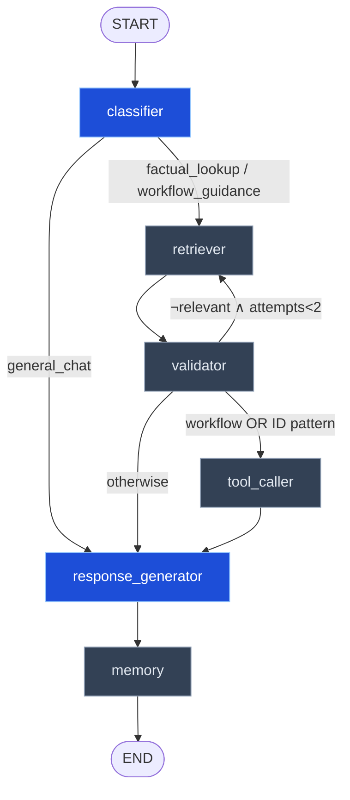

# ERP AI Procurement Assistant

A **LangGraph-powered agentic RAG** assistant for SAP S/4HANA Sourcing & Procurement.
Built on top of FAISS + Qwen2.5-7B (HuggingFace Inference API), wrapped in a
multi-node `StateGraph` with classification, retrieval validation, optional
tool calls, and short-term conversational memory.

The Streamlit UI surfaces the **graph execution trace** for every turn — node
order, timings, intermediate state — so you can see exactly how each answer
was produced.

---

## Architecture (LangGraph)



### Nodes

| Node | Role | LLM call? |
|------|------|-----------|
| `classifier` | Labels the query as **FACTUAL**, **WORKFLOW**, or **CHAT** to route the graph | ✅ (8-token, T=0) |
| `retriever` | FAISS similarity search; bumps `k` and expands SAP acronyms on retry | ❌ |
| `validator` | Heuristic relevance score (keyword overlap × chunk length); triggers re-retrieval below threshold | ❌ |
| `tool_caller` | Regex-driven helpers: `id_extractor` (PO/PR numbers), `step_counter` (workflow steps) | ❌ |
| `response_generator` | Builds the final prompt (context + tool output + memory) and calls Qwen2.5-7B | ✅ |
| `memory` | Maintains a deterministic rolling summary of the last 4 Q/A pairs | ❌ |

Routing logic: `general_chat` short-circuits to the generator; low-confidence
retrievals loop back through the retriever once with `k=8` and synonym
expansion before the validator force-passes to avoid loops; queries containing
PO/PR identifiers or workflow-step intent fan out through the tool caller.

The state schema, edges, and all node functions live under
[`src/graph/`](src/graph/).

---

## Tech Stack

| Component | Technology |
|-----------|-----------|
| Agent framework | **LangGraph** (StateGraph + conditional edges) |
| LLM | Qwen2.5-7B via HuggingFace Inference API |
| Embeddings | `all-MiniLM-L6-v2` (sentence-transformers) |
| Vector DB | FAISS (CPU) |
| Backend | FastAPI |
| Frontend | Streamlit (with execution-trace UI) |
| Doc loaders / splitters | LangChain Community |

---

## Project Structure

```
enhanced_erp_ai_procurement_assistant/
├── data/                       # ERP knowledge base (PDFs + TXTs)
├── src/
│   ├── document_loader.py      # Load PDF/TXT files
│   ├── text_chunker.py         # Split into semantic chunks
│   ├── embedder.py             # HuggingFace embeddings
│   ├── vector_store.py         # FAISS index management
│   ├── ingest_pipeline.py      # Full ingestion orchestrator
│   ├── retriever.py            # FAISS similarity search
│   ├── prompt_builder.py       # Context-injected prompts
│   ├── llm_handler.py          # Qwen calls (generate_response + classify)
│   ├── rag_pipeline.py         # (legacy linear pipeline — no longer wired)
│   └── graph/                  # ◀ NEW — LangGraph workflow
│       ├── state.py            # ProcurementState TypedDict
│       ├── config.py           # Thresholds, templates, synonym map
│       ├── utils.py            # @traced decorator, trace_event helper
│       ├── tools.py            # id_extractor, step_counter, expand_query
│       ├── graph.py            # StateGraph wiring + compiled_graph
│       └── nodes/              # One file per node
│           ├── classifier.py
│           ├── retriever.py
│           ├── validator.py
│           ├── tool_caller.py
│           ├── response_generator.py
│           └── memory.py
├── api/main.py                 # FastAPI POST /ask (LangGraph-backed)
├── ui/app.py                   # Streamlit chat + trace viewer
├── faiss_index/                # Auto-created after ingestion
├── Dockerfile, start.sh
├── requirements.txt
└── README.md
```

---

## Setup & Run

### 1. Prerequisites

- Python 3.9+ (matches the Docker base image used by Hugging Face Spaces)
- A HuggingFace API token. Copy `.env.example` to `.env` and set `HF_TOKEN`.

### 2. Install dependencies

```powershell
python -m venv venv
.\venv\Scripts\activate
pip install -r requirements.txt
```

### 3. Build the FAISS index (one-time)

```powershell
python src/ingest_pipeline.py
```

### 4. Smoke-test the graph (optional)

```powershell
python -m src.graph.graph
```

This invokes the full graph with a single query and prints the trace.

### 5. Start the API + UI

```powershell
uvicorn api.main:app --reload --port 8000
streamlit run ui/app.py
```

Open <http://localhost:8501>.

### 6. Docker / Hugging Face Spaces

```shell
docker build -t erp-assistant .
docker run -p 7860:7860 -p 8000:8000 erp-assistant
```

The Spaces deployment uses port `7860`.

---

## API

**`POST /ask`**

```jsonc
// Request
{
  "query": "How many steps are in the P2P workflow?",
  "history": [],                  // [{role, content}, ...] — client-held
  "memory_summary": "",           // rolling summary, client-held
  "session_id": "optional-id"
}

// Response (abridged)
{
  "query": "...",
  "answer": "...",
  "sources": ["p2p_workflow_summary.pdf"],
  "chunks": [{ "content": "...", "source": "..." }],
  "query_type": "workflow_guidance",
  "confidence": 0.71,
  "trace": [
    {"node": "classifier", "status": "ok", "duration_ms": 412.3, "summary": "workflow_guidance", "payload": {...}},
    {"node": "retriever",  "status": "ok", "duration_ms": 88.1,  "summary": "4 chunks @ k=4", "payload": {...}},
    {"node": "validator",  "status": "ok", "duration_ms": 0.4,   "summary": "conf=0.71 relevant=True", "payload": {...}},
    {"node": "tool_caller","status": "ok", "duration_ms": 1.2,   "summary": "step_counter", "payload": {...}},
    {"node": "response_generator", "status": "ok", "duration_ms": 2103.5, "summary": "...", "payload": {...}},
    {"node": "memory",     "status": "ok", "duration_ms": 0.2,   "summary": "1 turns", "payload": {...}}
  ],
  "tool_results": [{"tool_name": "step_counter", "input": {...}, "output": {...}}],
  "memory_summary": "Q: ... → A: ...",
  "history": [{"role":"user","content":"..."}, {"role":"assistant","content":"..."}]
}
```

The API is fully **stateless** — the client must echo `history` and
`memory_summary` back on each call.

---

## Sample Questions (and which paths they exercise)

| Question | Graph path |
|----------|-----------|
| "Hi, what can you do?" | classifier → response_generator |
| "What is a Purchase Requisition?" | classifier → retriever → validator → response_generator |
| "How many steps are in the P2P workflow?" | classifier → retriever → validator → **tool_caller** (step_counter) → response_generator |
| "Tell me about PO 4500001234" | classifier → retriever → validator → **tool_caller** (id_extractor) → response_generator |
| "What's the moon's atmospheric pressure?" | classifier → retriever → validator → **retriever (retry, k=8)** → validator → response_generator → "I don't have enough information…" |

---

## Knowledge Base

| File | Content |
|------|---------|
| `sap_procurement_sop.pdf` | Step-by-step SAP procurement SOPs |
| `p2p_workflow_summary.pdf` | Procure-to-Pay lifecycle |
| `sap_procurement_faq.txt` | Common Q&A pairs |
| `vendor_master.txt` | Vendor master data management |
| `material_master.txt` | Material master configuration |
| `pricing_conditions.txt` | SAP pricing condition records |
| `purchase_order.pdf` | Sample PO document |
| `supplier_invoice.pdf` | Sample supplier invoice |
| `rfq.pdf` | Sample Request for Quotation |
